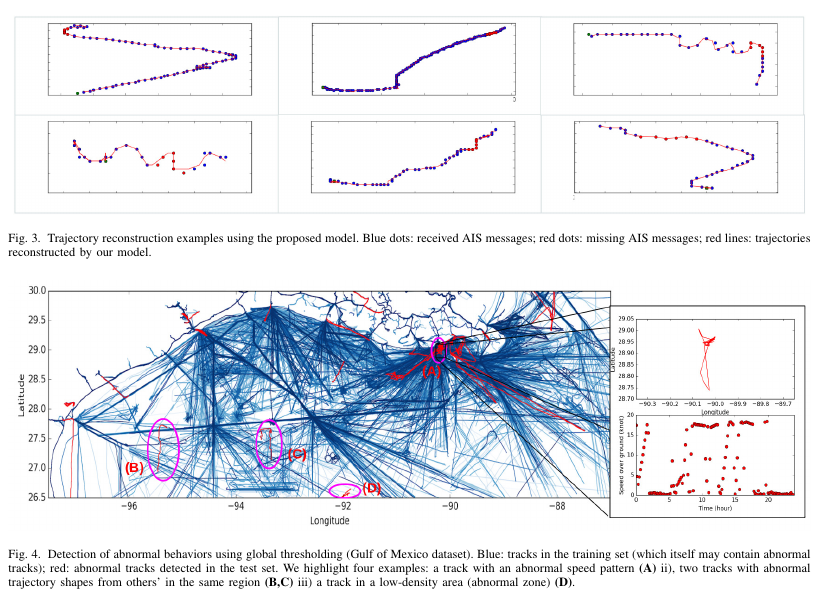
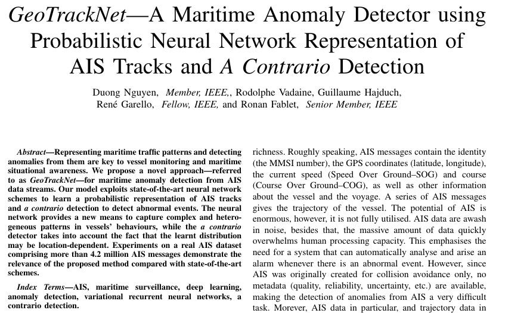

## Ships has a weird way to communicate.

  

  <a href="https://github.com/kantarcise/notebook/blob/master/Automatic%20Identification%20System/multitaskdl.pdf">How is using RNN's with latent variable modeling on AIS data streams makes sense?</a>

---

  

  <a href="https://github.com/kantarcise/notebook/blob/master/Automatic%20Identification%20System/GeoTrackNet.pdf">How can Neural Networks help vessel monitoring?</a>  

