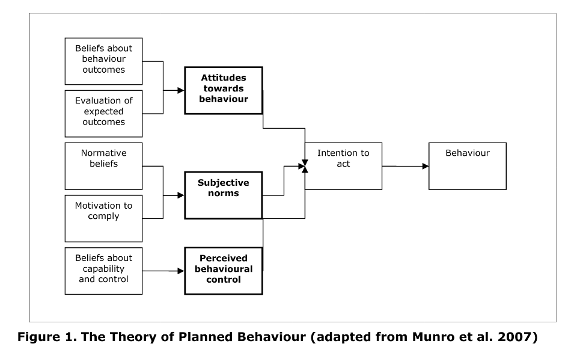
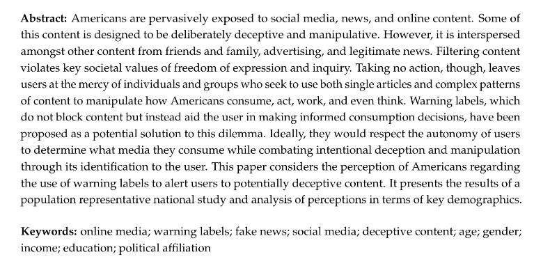

## Some papers I found valuable on Behavioral Science.

  

  <a href="https://github.com/kantarcise/notebook/blob/master/Behavioral%20Science/Job_Satisfaction_and_Psychological_Distress.pdf">How important is Job Satisfaction?</a>

---

  

  <a href="https://github.com/kantarcise/notebook/blob/master/Behavioral%20Science/behaviour_review_theory.pdf">How do humans behave ?</a>  

---

  

  <a href="https://github.com/kantarcise/notebook/blob/master/Behavioral%20Science/behavsci-12-00059-v3.pdf">Are we aware about manipulative content?</a> 

