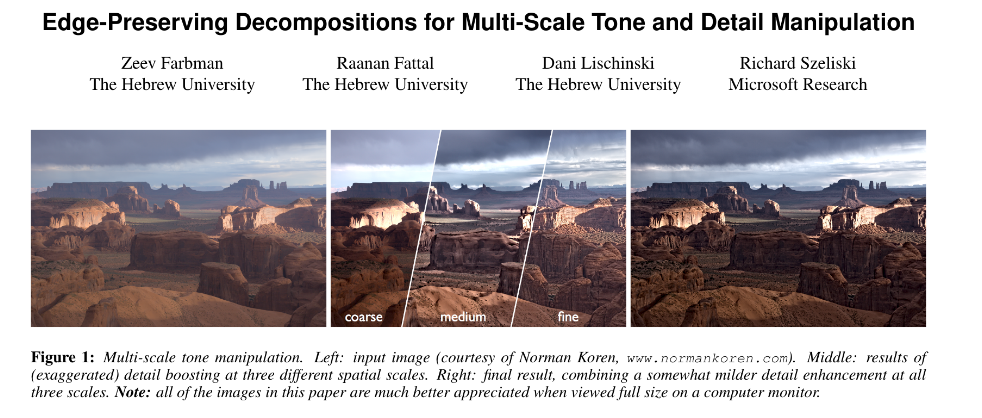

## Computers are not sharp eyed, but humans try really hard to make them see.

  

  <a href="https://github.com/kantarcise/notebook/blob/master/Computer%20Vision/New%20Edge%20Detection.pdf">Why is Edge Detection is a Thing?</a>

---

  

  <a href="https://github.com/kantarcise/notebook/blob/master/Computer%20Vision/epd.pdf">How can edge preserving increase picture quality?</a>  

---

  

  <a href="https://github.com/kantarcise/notebook/blob/master/Computer%20Vision/ferentinos2018.pdf">Deep learning for plants?</a> 

