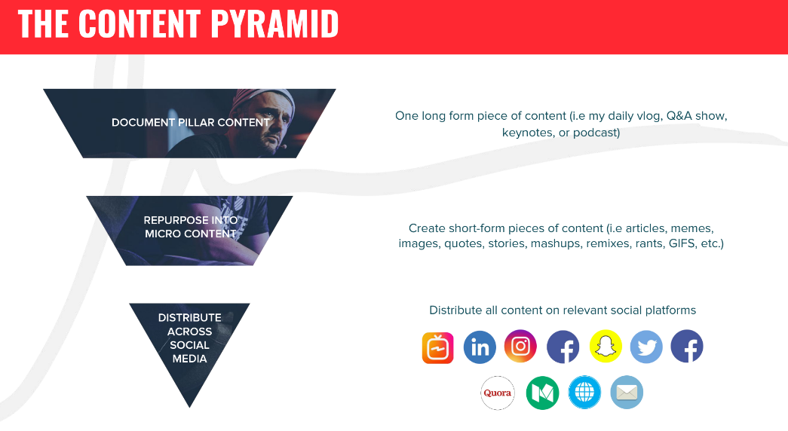

## Because everything comes down to "Communication".

  

  <a href="https://github.com/kantarcise/notebook/blob/master/Content%20Distribution/GV-Content-Model-1.pdf">How is Gary playing the game?</a>

---

This is a starting point, if you want to grow on social, have eyeballs, make stuff known.

[The $1.80 Instagram Strategy](https://garyvaynerchuk.com/instagram-for-business-180-strategy-grow-business-brand/)

The number of Instagram followers you have means nothing if you can’t build a community of 
like-minded people who care and engage. The only real way to do this from scratch
is to become part of the conversation.

I was super inspired after meeting Shane that I came up with what I like to call the $1.80 Instagram
strategy which translates to leaving your personal .02 cents on the top 9 trending Instagram
posts for 10 different hashtags that are relevant to your brand or business every single day.
