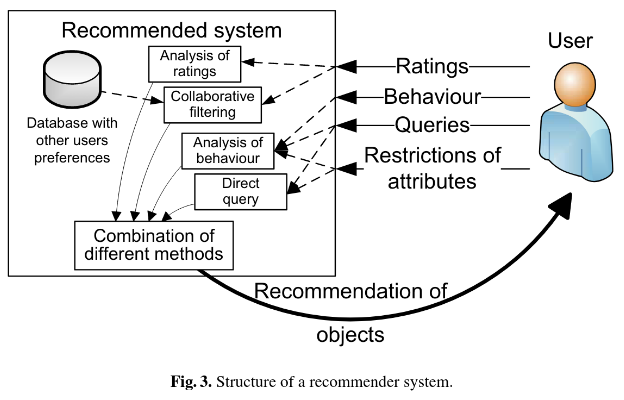

## Data is the new oil. It has been for a decade.

  

  <a href="https://github.com/kantarcise/notebook/blob/master/Data%20Mining/Various_aspects_of_user_preference_learning_and_re.pdf">Why is User Preference Learning is important ?</a>

---

[Practical Data Engineering](https://hpi.de/fileadmin/user_upload/fachgebiete/rabl/Lectures/PDE_Poster/PDE_Angelika_Wieck.pdf)

---

[Nvidia Inception Program](https://blogs.nvidia.com/blog/generative-ai-startups-africa-middle-east/)

Huge opportunity here.

---
