# How deep is your love ? 
### Actually, your neural network.

  

This folder contains papers from conferances and global journals about deep learning.

---

  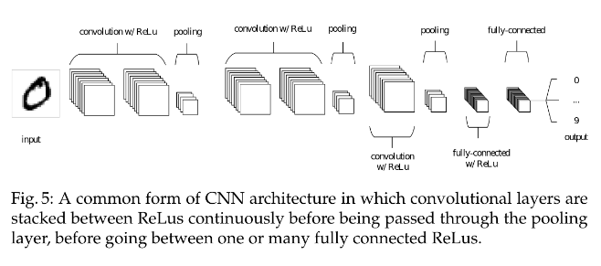

  <a href="https://github.com/kantarcise/notebook/blob/master/Deep%20Learning/An%20Introduction%20to%20Convolutional%20Neural%20Networks.pdf"> What are CNN's, in the most basic sense?</a> 

---

  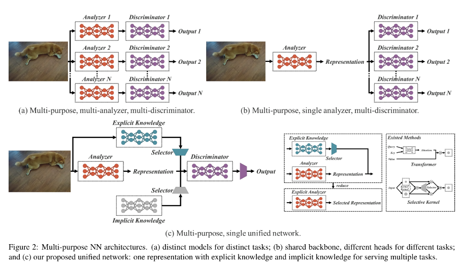

  <a href="https://github.com/kantarcise/notebook/blob/master/Deep%20Learning/2105.04206v1.pdf">How can computer understanding gets closer to a human one (Implicit & Explicit Knowledge) ?</a>

---

  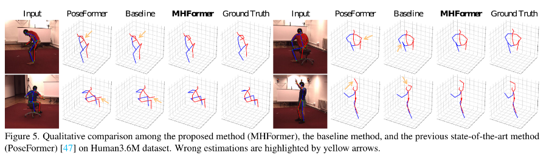

  <a href="https://github.com/kantarcise/notebook/blob/master/Deep%20Learning/2111.12707.pdf"> What is the importance of DL flavored pose estimation? </a>  

---

  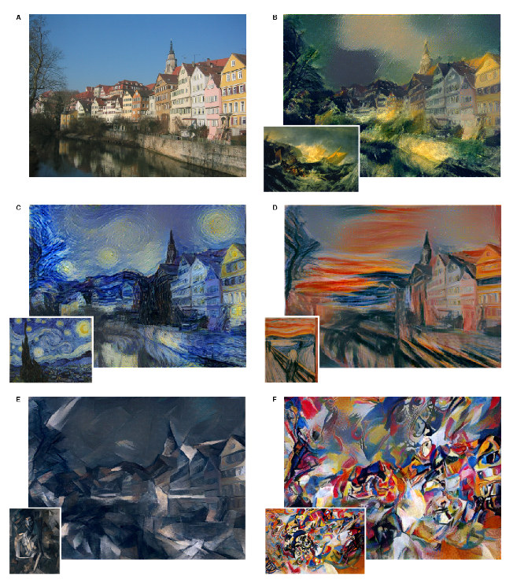

  <a href="https://github.com/kantarcise/notebook/blob/master/Deep%20Learning/A%20Neural%20Algorithm%20of%20Artistic%20Style.pdf"> Can we make artistic content with Deep learning ?</a> 

---

  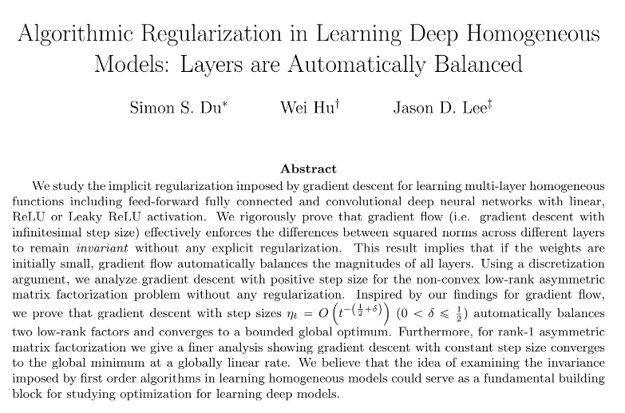

  <a href="https://github.com/kantarcise/notebook/blob/master/Deep%20Learning/Algorithmic%20Regularization%20in%20Learning%20Deep%20Homogeneous%20Models.pdf"> How do you optimize a deep learning model?</a> 

---

  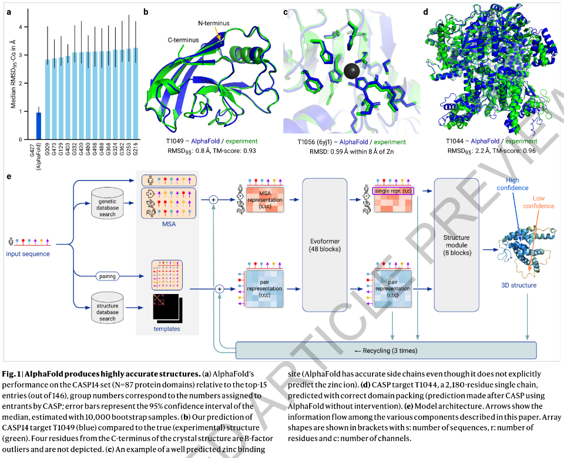

  <a href="https://github.com/kantarcise/notebook/blob/master/Deep%20Learning/AlphaFold-Protein.pdf"> Can DL used to construct protein models?</a> 

---

  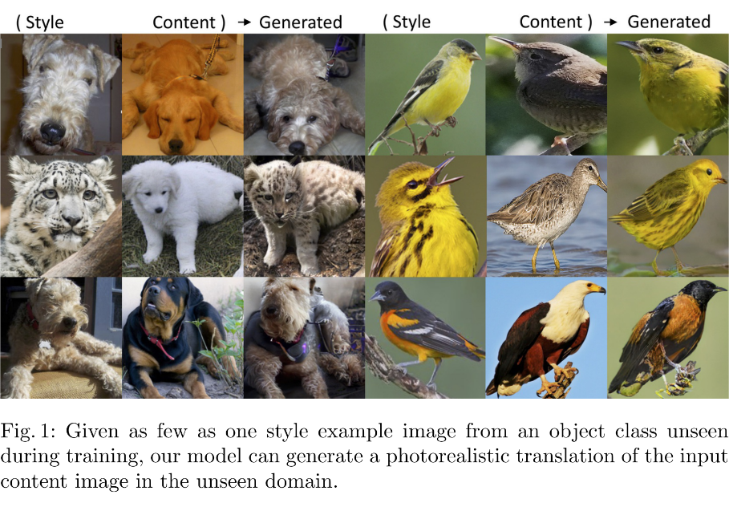

  <a href="https://github.com/kantarcise/notebook/blob/master/Deep%20Learning/COCO-FUNIT.pdf"> How can we tackle content loss problem in image-to-image translation?</a> 

---

  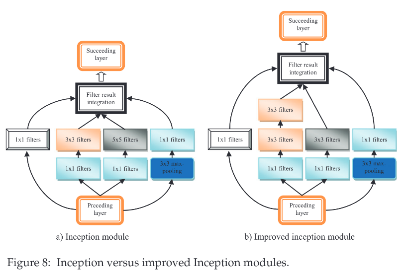

  <a href="https://github.com/kantarcise/notebook/blob/master/Deep%20Learning/Deep%20Convolutional%20Neural%20Networks%20for%20Image%20Classification%20A%20Comprehensive%20Review.pdf"> Why is CNN's good at image classification?</a> 

---

  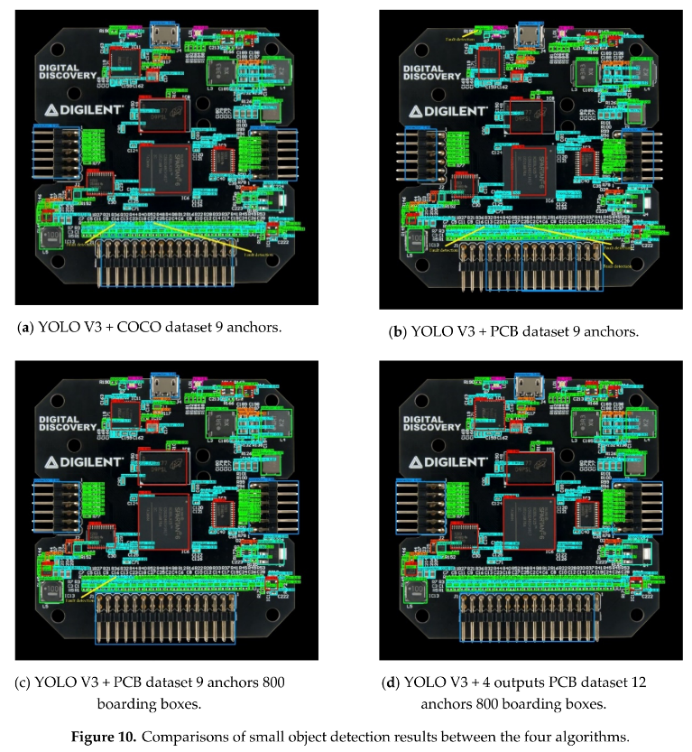

  <a href="https://github.com/kantarcise/notebook/blob/master/Deep%20Learning/Application%20Research%20of%20Improved%20YOLO%20V3%20Algorithm%20in%20PCB%20Electronic%20Component%20Detection.pdf"> Can we use CNN's to detect electronic components?</a> 

---

  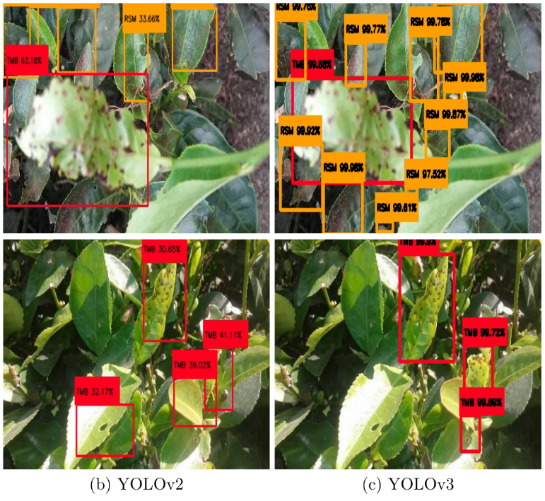

  <a href="https://github.com/kantarcise/notebook/blob/master/Deep%20Learning/Detection%20of%20diseases%20and%20pests%20on%20images%20captured%20in%20uncontrolled%20conditions%20from%20tea%20plantations.pdf"> How can DL help to plants?</a> 

---

  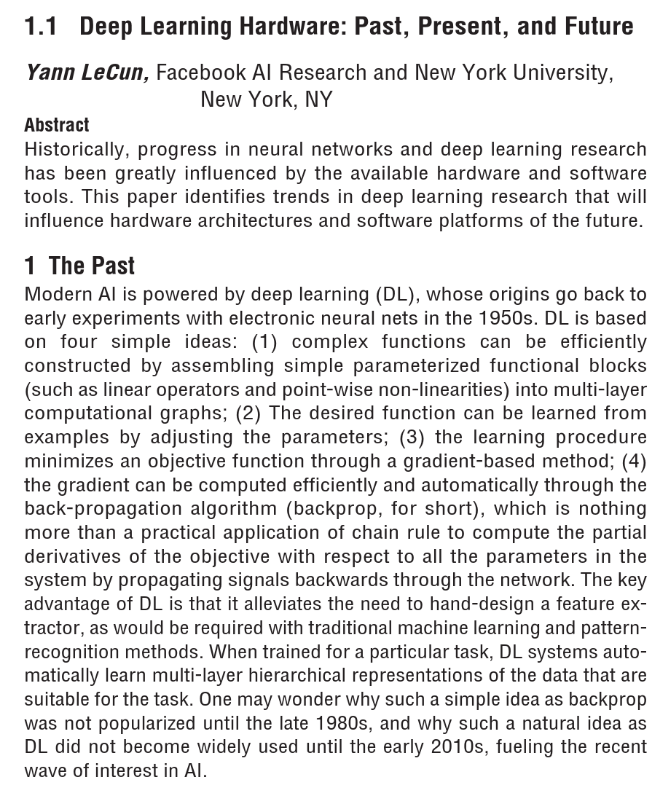

  <a href="https://github.com/kantarcise/notebook/blob/master/Deep%20Learning/Deep%20Learning%20Hardware%20Past%2C%20Present%2C%20and%20Future.pdf"> What is the current status of Hardware in use of DL?</a> 

---

  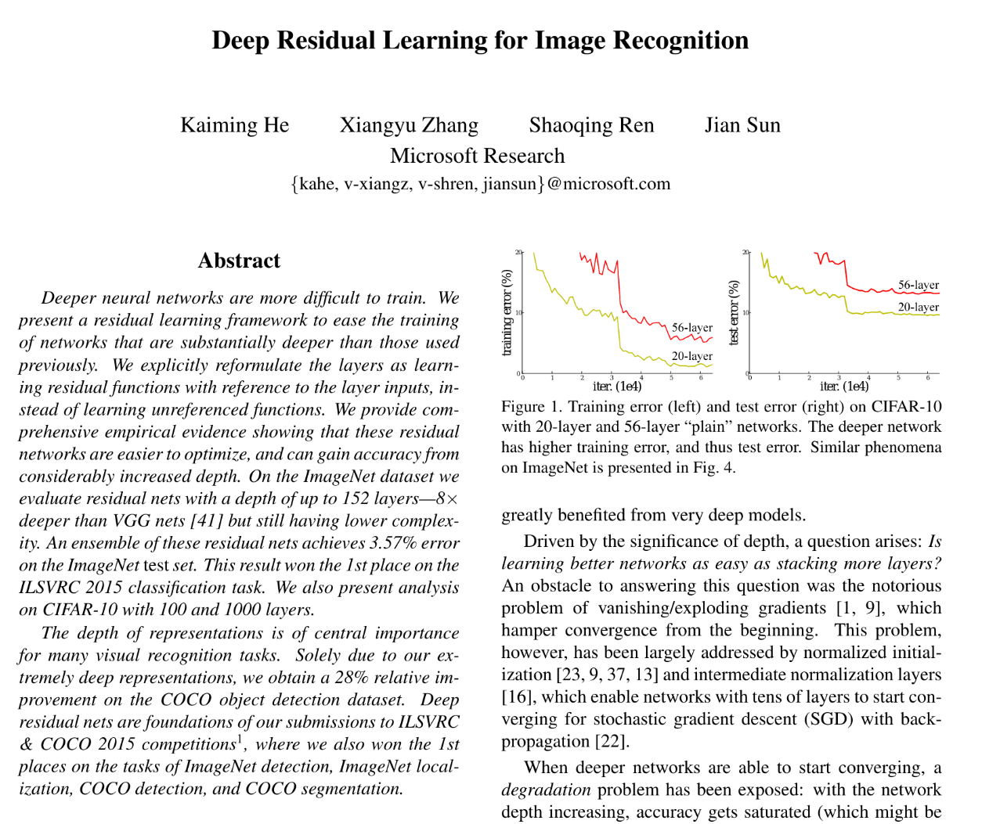

  <a href="https://github.com/kantarcise/notebook/blob/master/Deep%20Learning/Deep%20Residual%20Learning%20for%20Image%20Recognition.pdf"> Can residual networks help models to be better?</a> 

---

  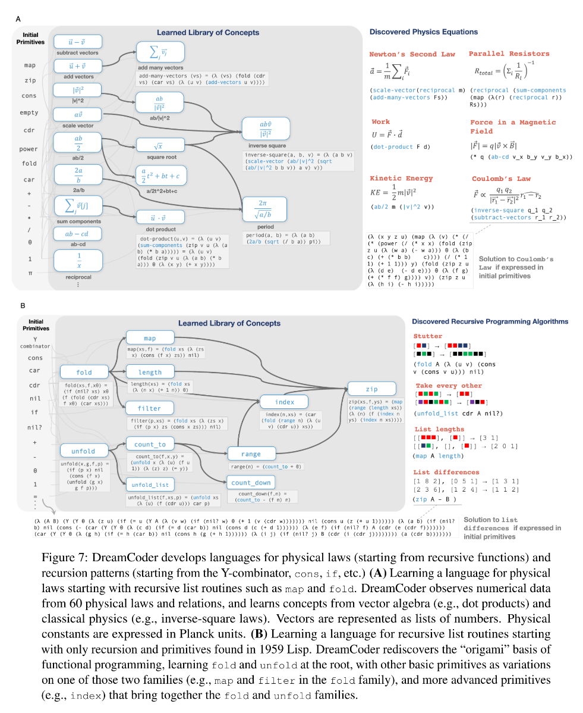

  <a href="https://github.com/kantarcise/notebook/blob/master/Deep%20Learning/DreamCoder.pdf"> Wake-sleep Bayesian program learning, how does it work for solving basic & complex problems?</a> 

