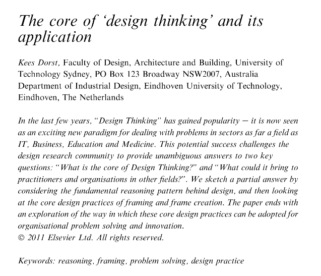

# Design. It's everywhere.

  

---

  

  <a href="https://github.com/kantarcise/notebook/blob/master/Design/XF_20MY_MB_CA-EN_V4_DX.pdf">What makes Jaguar XF so special?</a>  

---

  

  <a href="https://github.com/kantarcise/notebook/blob/master/Design/design_thinking_core.pdf">Practically, what does it mean to have a design thinking mindset?</a>  

---

  

  <a href="https://github.com/kantarcise/notebook/blob/master/Design/aventador.pdf">How is Aventador designed?</a> 

