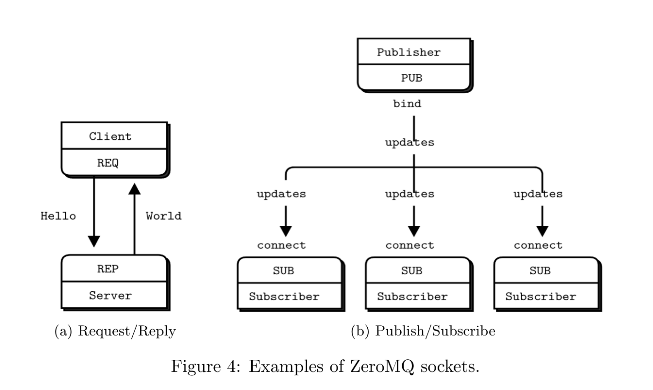
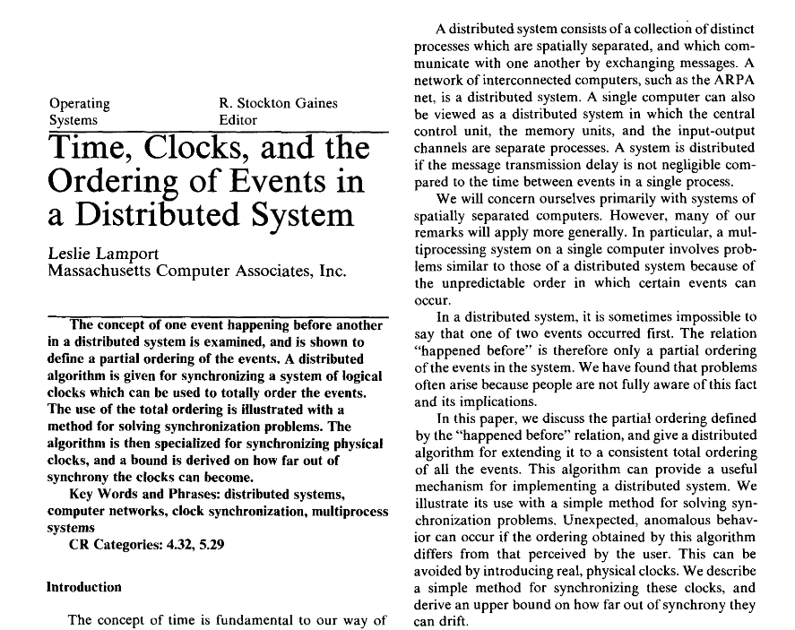
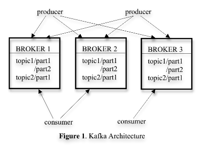

# Time, is one of the core aspects of coding.

## Here are the [fallacies](https://en.wikipedia.org/wiki/Fallacies_of_distributed_computing) of distributed programming

- The network is reliable;
- Latency is zero;
- Bandwidth is infinite;
- The network is secure;
- Topology doesn't change;
- There is one administrator;
- Transport cost is zero;
- The network is homogeneous.

  

### Now, let's get to work :)

--------------

### Online Articles

- [Live Video Streaming Using Multiple Smartphones With ImageZMQ](https://towardsdatascience.com/live-video-streaming-using-multiple-smartphones-with-imagezmq-e260bd081224)

- [High-performance Scalable Realtime Distributed Video Processing With Python3, OpenCV and ZeroMQ](https://bitworks.software/en/scalable-realtime-opencv-processing-with-zeromq.html)

### Possibly Best Source For Agile Development

- [ØMQ - The Guide](https://zguide.zeromq.org/)

### Multiprocessing

- [Multiprocessing - Part 1](https://www.geeksforgeeks.org/multiprocessing-python-set-1/)

- [Multiprocessing - Part 2](https://www.geeksforgeeks.org/multiprocessing-python-set-2/)

---

  

  <a href="https://github.com/kantarcise/notebook/blob/master/Distributed%20Programming/Modern%20Messaging%20for%20Distributed%20Sytems.pdf">What are the modern messaging solutions for distributed systems? </a>

---

  

  <a href="https://github.com/kantarcise/notebook/blob/master/Distributed%20Programming/Time%2C%20Clocks%2C%20and%20the%20Ordering%20of%20Events%20in%20a%20Distributed%20System.pdf">How is task ordering achieved in a complex codebase?</a>  

---

  

  <a href="https://github.com/kantarcise/notebook/blob/master/Distributed%20Programming/Kafka.pdf">Why Linkedin engineers made Kafka?</a>  

