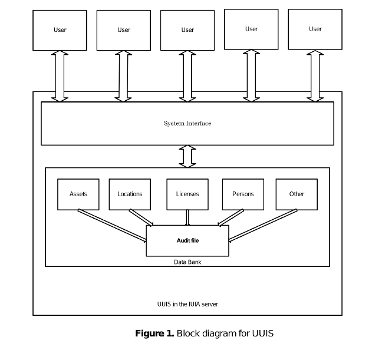
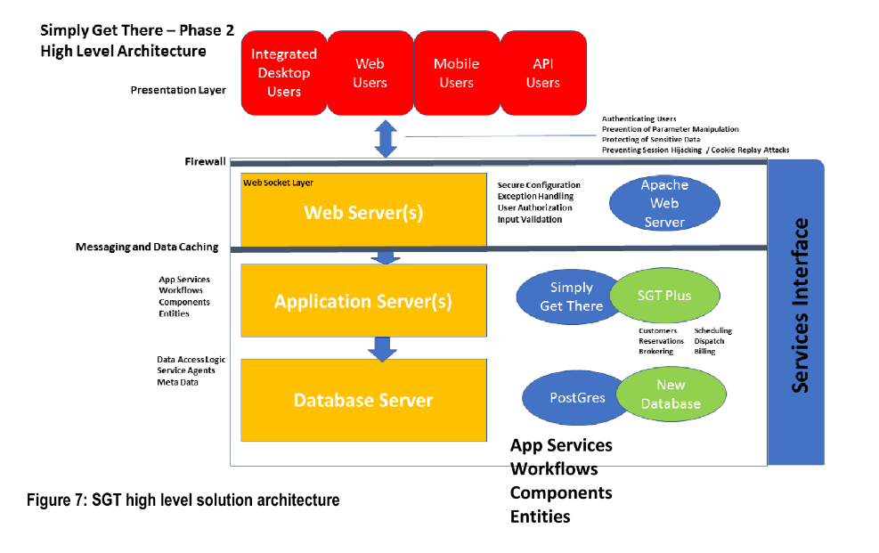
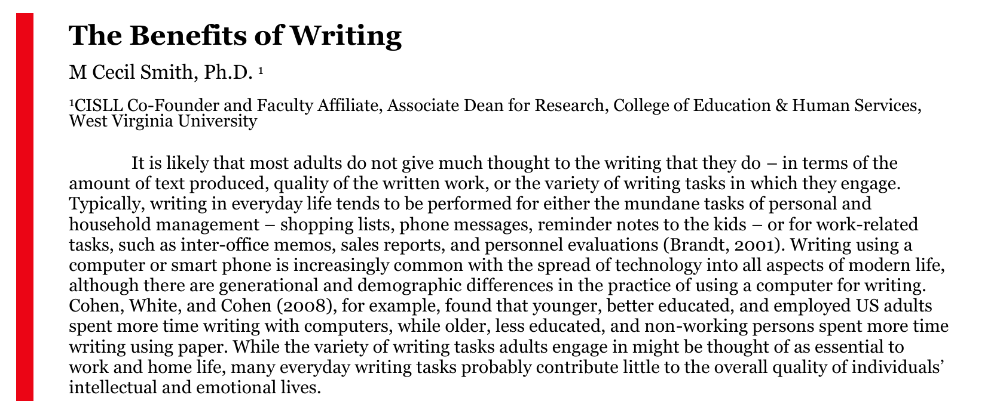

# Documentation

Write it down, so you don't lose it in the sea :)

  

## Links

- [Design Docs at Google](https://www.industrialempathy.com/posts/design-docs-at-google/)
- [Ready, Set, Code: How Engineering Teams Use Trello](https://blog.trello.com/engineering-teams-sample-trello-boards)
- [Software Documentation Types and Best Practices](https://blog.prototypr.io/software-documentation-types-and-best-practices-1726ca595c7f)
-----------------
- [How to Write a Design Document - Berkeley](https://people.eecs.berkeley.edu/~kubitron/courses/cs162-F06/design.html)
- [How to write a good software design doc - Medium](https://medium.com/free-code-camp/how-to-write-a-good-software-design-document-66fcf019569c)
- [Software Development Processes - MIT](https://ocw.mit.edu/courses/electrical-engineering-and-computer-science/6-170-software-studio-spring-2013/lecture-notes/MIT6_170S13_54-devel-proce.pdf)
- [Sufficient Design - Industrial Logic](https://www.industriallogic.com/blog/sufficient-design/)
---------------------
- [How to make a Use Case Diagram](https://drawio-app.com/uml-use-case-diagrams-with-draw-io/)
- [Formatting Your Documentation Content from Apple](https://developer.apple.com/documentation/xcode/formatting-your-documentation-content)

---

  

  <a href="https://github.com/kantarcise/notebook/blob/master/Documentation/Software%20Design%20Document%20-%20Testing%2C%20Deployment%20and%20Configuration%20Management.pdf">How does one approach to design a Software Design Document?</a>

---

  

  <a href="https://github.com/kantarcise/notebook/blob/master/Documentation/MSAA-System%20Design%20Document.pdf">Why is a System Design Document important in a big project?</a>

---

  

  <a href="https://github.com/kantarcise/notebook/blob/master/Documentation/the-benefits-of-writing.pdf">What are the benefits of writing?</a>

