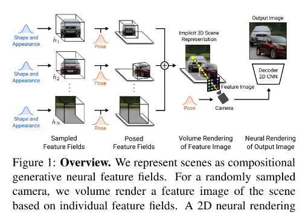

## They are Actually Used In Real Life

GANs are generative models: they create new data instances that resemble your training data. For example, GANs can create images that look like photographs of human faces, even though the faces don't belong to any real person. 

  

  <a href="https://github.com/kantarcise/notebook/blob/master/Generative%20Adversarial%20Networks/Niemeyer2021CVPR.pdf">What if we combine scene representation with a neural rendering pipeline?</a>

---

  

  <a href="https://github.com/kantarcise/notebook/blob/master/Generative%20Adversarial%20Networks/Sauer2021NEURIPS.pdf">what is the effect of mixing features across channels and resolutions in a GAN?</a>  

---

  

  <a href="https://github.com/kantarcise/notebook/blob/master/Generative%20Adversarial%20Networks/WassersteinGANs.pdf">What makes WGAN's (PS: Instead of using a discriminator to classify or predict the probability of generated images as being real or fake, the WGAN changes or replaces the discriminator model with a critic that scores the realness or fakeness of a given image.) special? </a> 

