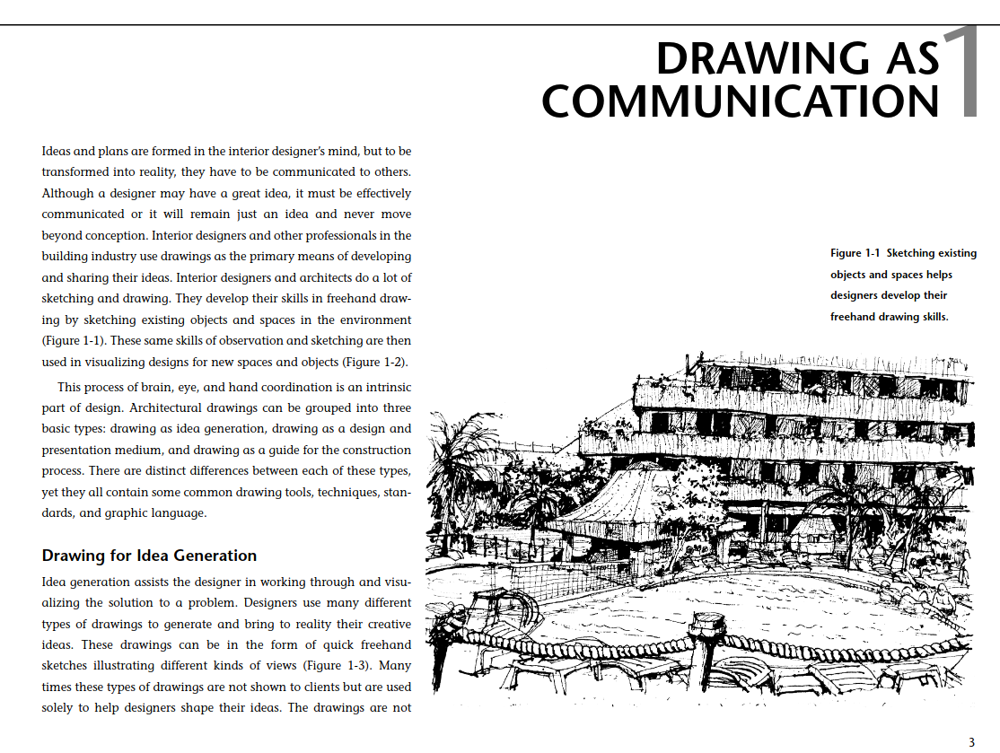
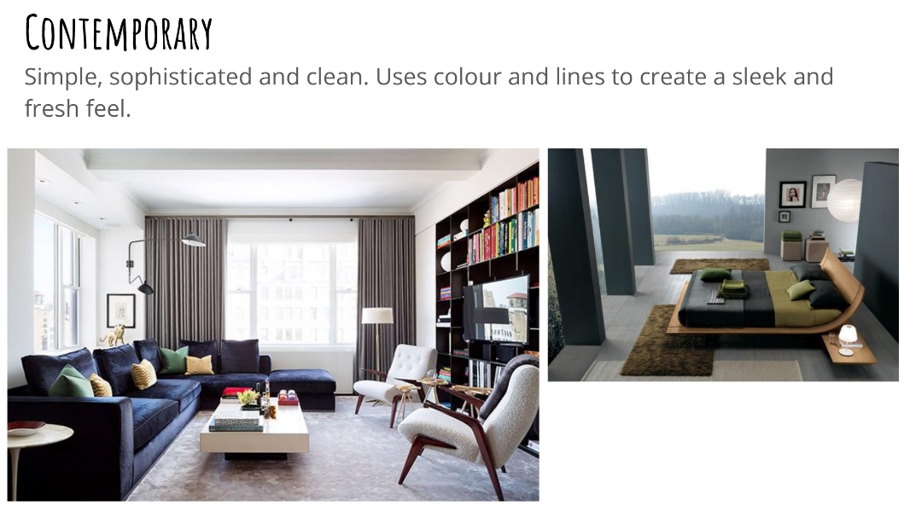
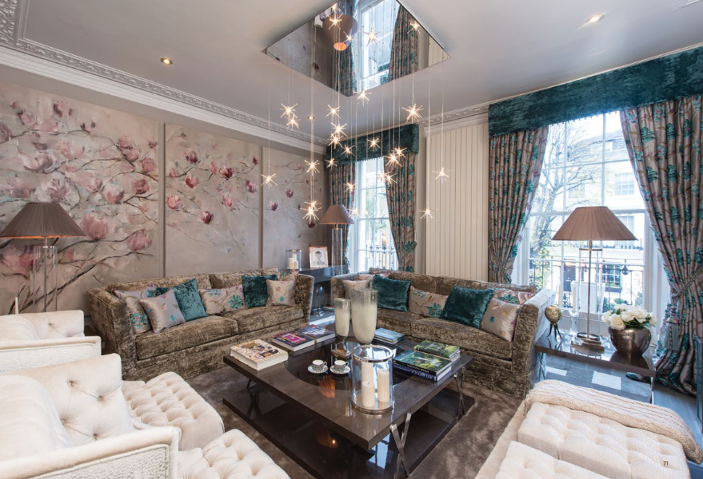

## You are a Designer (You might not know it yet).

  

---

  

  <a href="https://github.com/kantarcise/notebook/blob/master/Interior%20Design/Construction%20Drawings%20and%20Details%20for%20Interiors.pdf"> Why is drawing important?</a> 

---

  

  <a href="https://github.com/kantarcise/notebook/blob/master/Deep%20Learning/2105.04206v1.pdf">What are the types of design categories in a living area?</a>

---

  

  <a href="https://github.com/kantarcise/notebook/blob/master/Interior%20Design/1463496953_a4_brochure_rebosio-spangulo.pdf"> How interior design is made for a World Class Hotel Brand? </a>  

