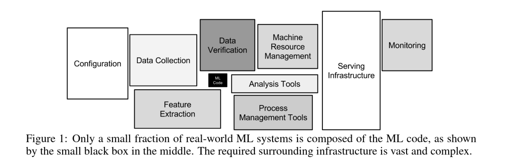
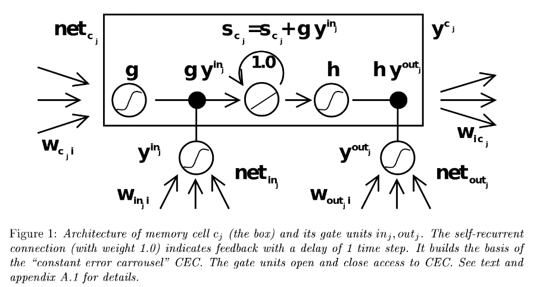
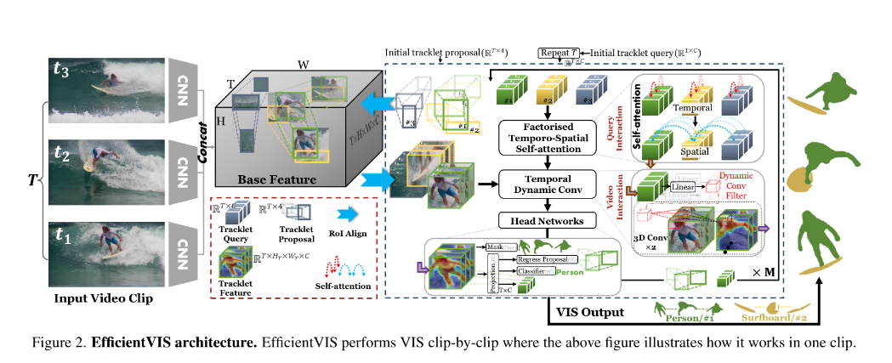

## One of the most fascinating technology of our time.

  

  <a href="https://github.com/kantarcise/notebook/blob/master/Machine%20Learning/NIPS-2015-hidden-technical-debt-in-machine-learning-systems-Paper.pdf">What is really required to make a ML product?</a>

---

  

  <a href="https://github.com/kantarcise/notebook/blob/master/Machine%20Learning/How%20to%20Avoid%20Machine%20Learning%20Pitfalls.pdf">How does the roadmap for a ML project looks like?</a>

---

  

  <a href="https://github.com/kantarcise/notebook/blob/master/Machine%20Learning/lstm.pdf">Why is LSTM invented?</a>

---

  

  <a href="https://github.com/kantarcise/notebook/blob/master/Machine%20Learning/efficient-video-instance-segmentation-via-tracklet-query-and-proposal.pdf">Is instance segmentation without data association & post-processing possible?</a>

---

## Talks

[Pushing the limits of Python ML infra at Netflix - Ville Tuulos, Ravi Kiran Chirravuri, Savin Goyal](https://www.youtube.com/watch?v=8jTo3bVni3E)
