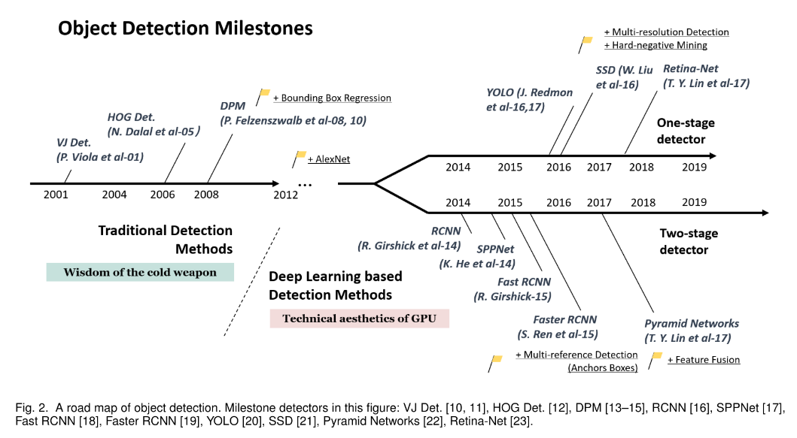
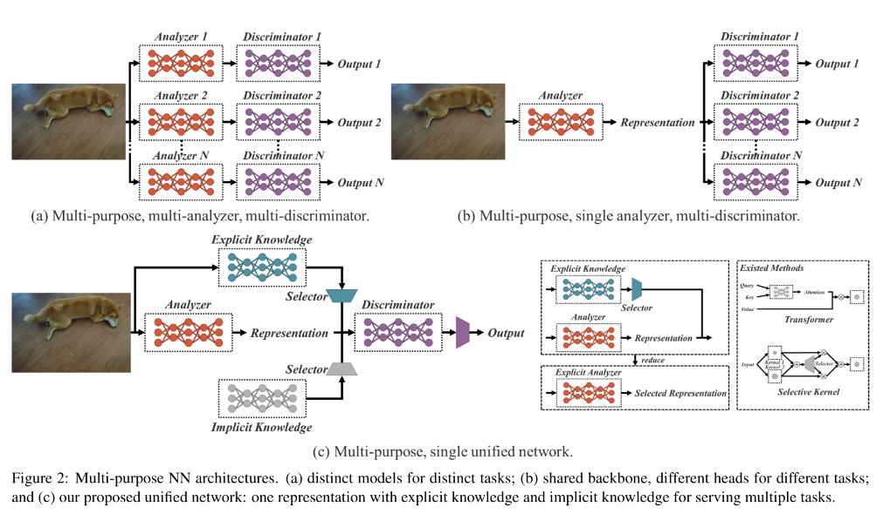
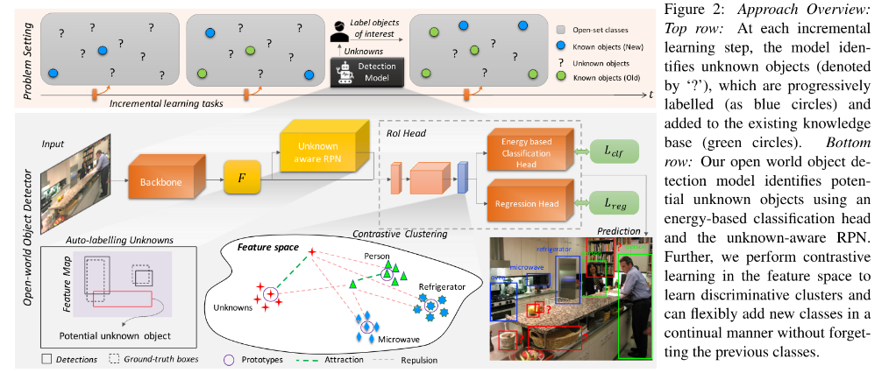

## Object Detection is used in a different industries in production.

  

---

  

  <a href="https://github.com/kantarcise/notebook/blob/master/Object%20Detection/(Object%20Detection%20in%2020%20Years)1905.05055.pdf">How does the history of object detection looks like?</a>

---

  

  <a href="https://github.com/kantarcise/notebook/blob/master/Behavioral%20Science/behaviour_review_theory.pdf">How does explicit and implicit knowledge effect to a DL model?</a>  

---

  

  <a href="https://github.com/kantarcise/notebook/blob/master/Object%20Detection/2103.02603.pdf">What is the role of the "environment" for human understanding for unknown objects?</a> 

