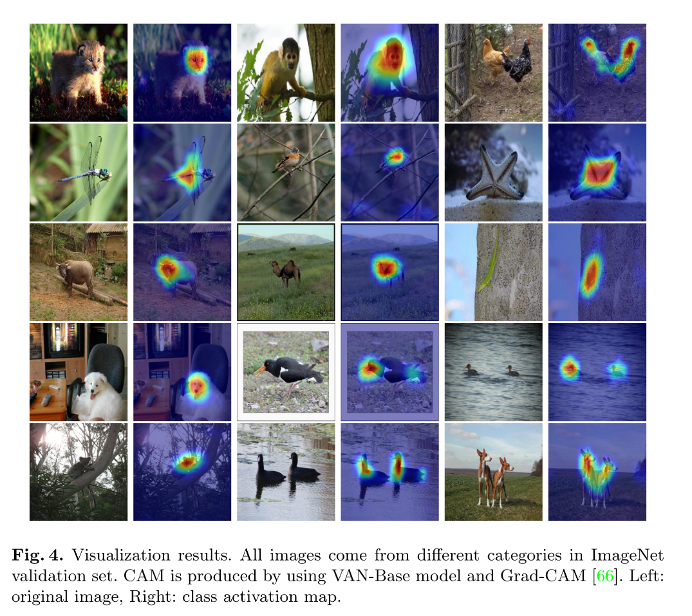
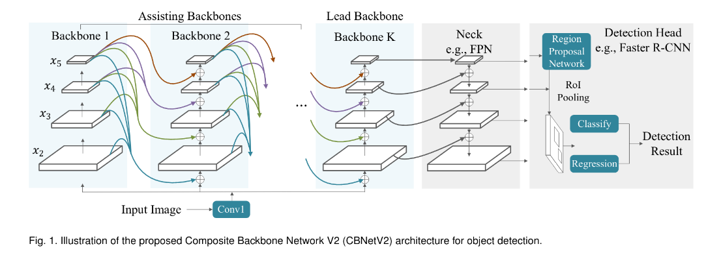

## Object Detection is used in a different industries in production.

---

  

---

  

  <a href="https://github.com/kantarcise/notebook/blob/master/Object%20Detection/2207.02696.pdf">What was the reason behind the success of Yolov7?</a>

---

  

  <a href="https://github.com/kantarcise/notebook/blob/master/Object%20Detection/(Object%20Detection%20in%2020%20Years)1905.05055.pdf">How does the history of object detection looks like?</a>

---

  

  <a href="https://github.com/kantarcise/notebook/blob/master/Behavioral%20Science/behaviour_review_theory.pdf">How does explicit and implicit knowledge effect to a DL model?</a>  

---

  

  <a href="https://github.com/kantarcise/notebook/blob/master/Object%20Detection/2103.02603.pdf">What is the role of the "environment" for human understanding for unknown objects?</a> 

---

  

  <a href="https://github.com/kantarcise/notebook/blob/master/Object%20Detection/2202.09741v1.pdf">Can Large Kernel Attention network enable self-adaptive and long range correlations in self-attention?</a> 

---

  

  <a href="https://github.com/kantarcise/notebook/blob/master/Object%20Detection/CBNetV2:%20A%20Composite%20Backbone%20Network%20Architecture%20for%20Object%20Detection.pdf">What if we used multiple identical backbones and expand the reseptive field?</a> 

