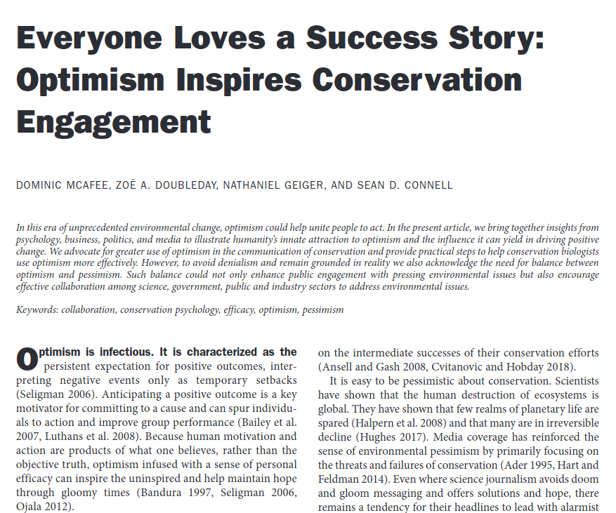
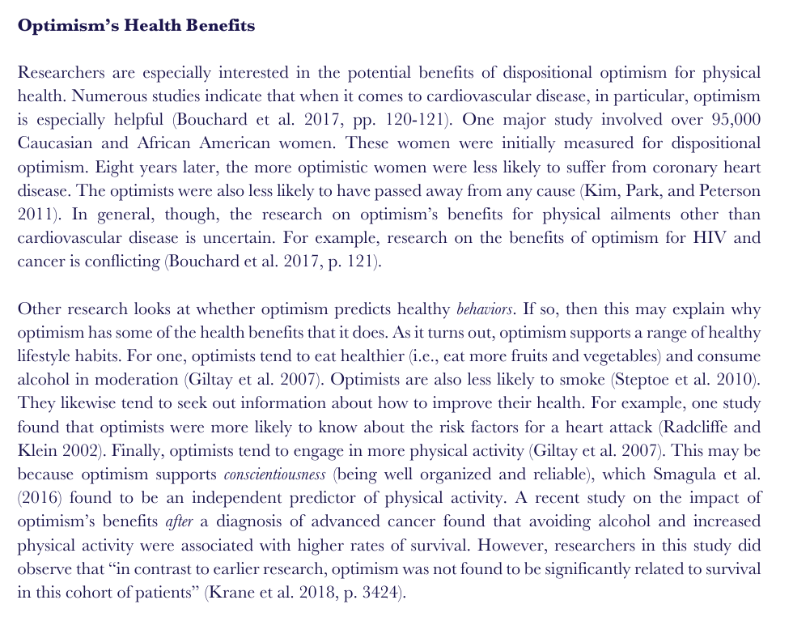
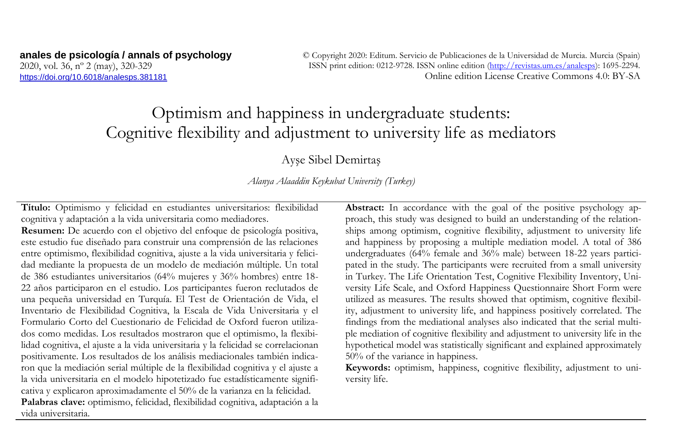

### It's simply healtier to be an optimist.

  

---

  

  <a href="https://github.com/kantarcise/notebook/blob/master/Optimism/biz019.pdf">How does being an optimist help in taking action?</a>

---

  

  <a href="https://github.com/kantarcise/notebook/blob/master/Optimism/JTF-Hope-Optimism.pdf">What is the meaning of hope and optimism?</a>  

---

  

  <a href="https://github.com/kantarcise/notebook/blob/master/Optimism/1695-2294-ap-36-02-320.pdf">What is the relation between optimism, cognitive flexibility and happiness?</a>  

---

