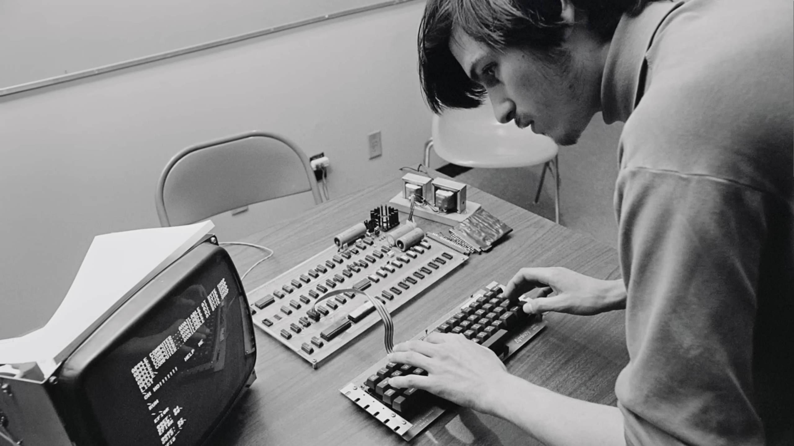

...

This video might be the most influential content in my life, so far. 

09/06/2022

Still, the best. Whenever you feel lonely, just share Steve's energy. 

30/09/2022

*"You are an aiming creature. You look to at a point and you move towards it. It's built right into you.*

*So, you have an aim. Let's say your aim is the highest possible aim. Then that sets up the world around you."*

07/10/2022

It's in responsibility that most people find the meaning that sustains them through life. It's not in happiness.

16/01/2023

If you don't have a sustaining meaning in your life, you'll be miserable. Just like you'd be hungry if there was no food.
We already learned that meaning comes from responsibility. 
So, good to go. Onwards to the biggest adventure. =)

12/04/2023

"The cost of success is years of feeling like an idiot for things you should’ve known by now."

For the first time, a simple sentence had a deep effect on me.

03/06/2023

"What if I can pull this off?"

"What if I can pull off a f****** miracle?"

"WHat if I can become someone that NOONE thinks I can be?"

27/07/2023

[Make something wonderful.](https://book.stevejobsarchive.com/)

There’s lots of ways to be, as a person. And some people express their deep appreciation in different ways. 
But one of the ways that I believe people express their appreciation to the rest of humanity is to make
something wonderful and put it out there.

And you never meet the people. You never shake their hands. You never hear their story or tell yours.
But somehow, in the act of making something with a great deal of care and love, something’s transmitted there. 
And it’s a way of expressing to the rest of our species our deep appreciation. 
So we need to be true to who we are and remember what’s really important to us.

—Steve, 2007

14/08/2023

...

# Celebrating Steve - Apple 

 

When you grow up, you tend to get told the world is the way it is and your life is just to live your life inside the world. 

Try not to bash into the walls too much. 

Life can be much broader once you discover one simple fact, and that is: – 

## **Everything around you that you call life, was made up by people that were no smarter than you**. 

And you can change it.

You can influence it. 

You can build your own things that other people can use.
