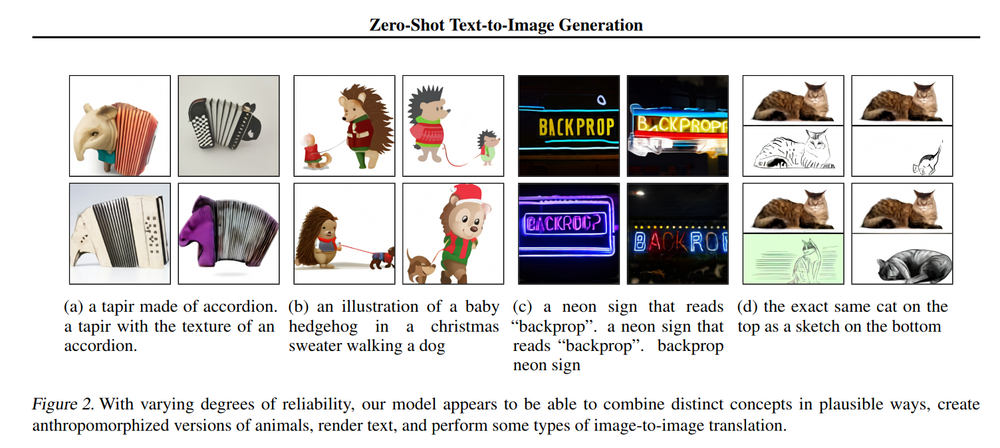

## Transformers, not only detecting objects but making them.

  

  <a href="https://raw.githubusercontent.com/kantarcise/notebook/master/Transformers/2102.12092.pdf"> Can we use an autoregressive transformer for text-to-image generation? </a>

---
