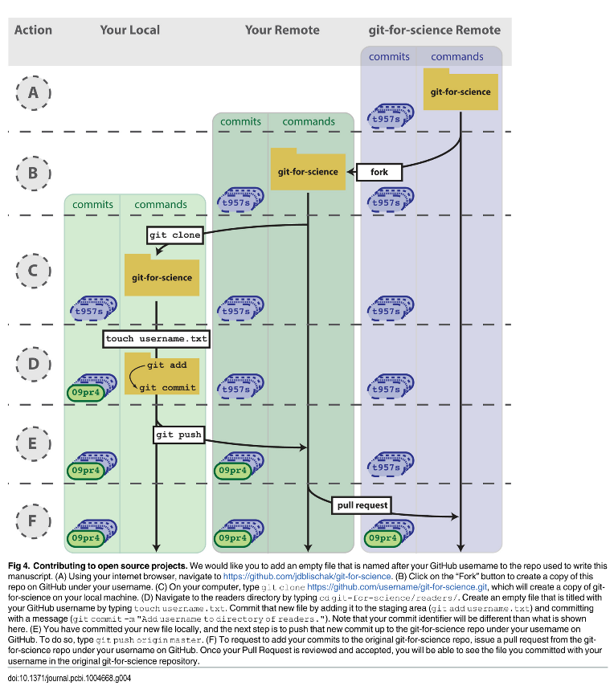

# Gotta Work Together

Regardless of the Technology, there is a need for version control. 

So, let's do it right :)

  

---

### Online Articles

- [Ubuntu Git Tutorial](http://manpages.ubuntu.com/manpages/trusty/man7/gittutorial.7.html)

- [GitLab Basics](https://docs.gitlab.com/ee/gitlab-basics/start-using-git.html)

- [Code Review Guidelines at GitLab - (Gold)](https://docs.gitlab.com/ee/development/code_review.html)

---

  

  <a href="https://github.com/kantarcise/notebook/blob/master/Version%20Control/A_Quick_Introduction_to_Version_Control_with_Git_a.pdf">How can we commit to an open source project?</a>

---
