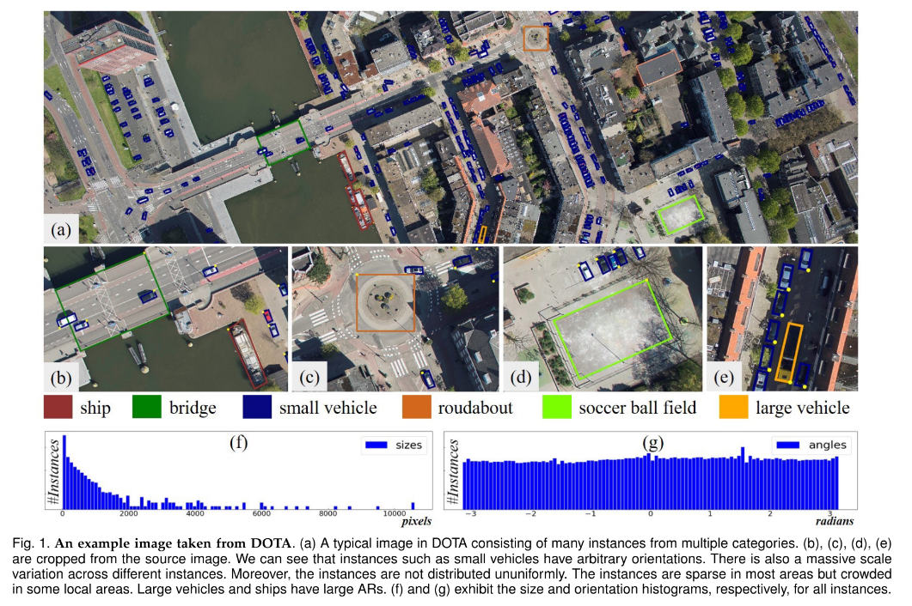
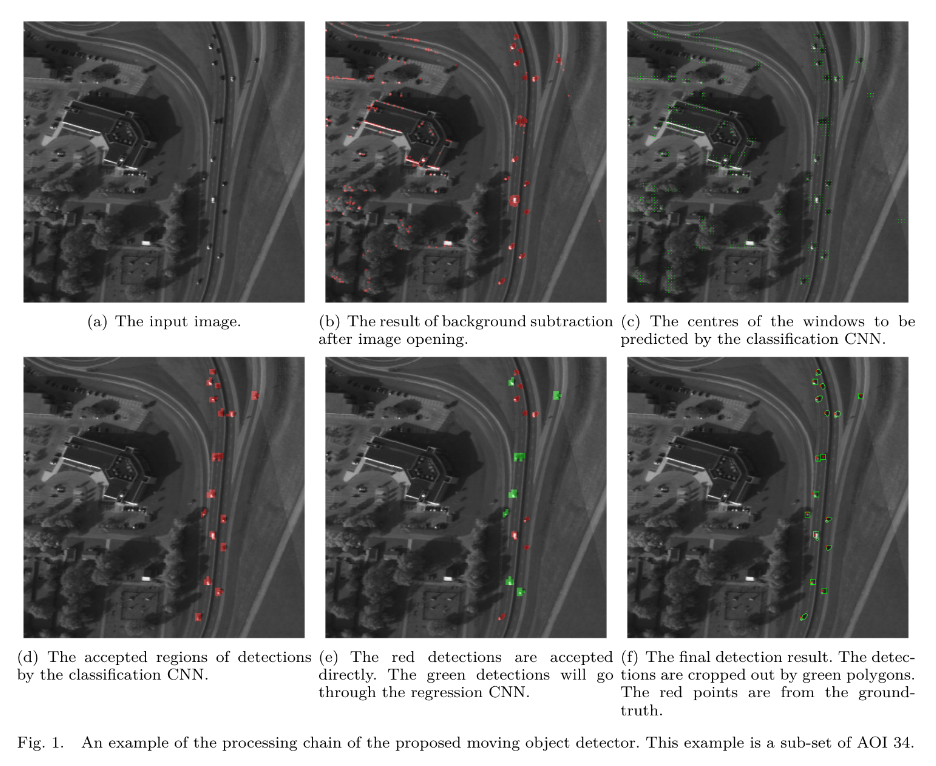
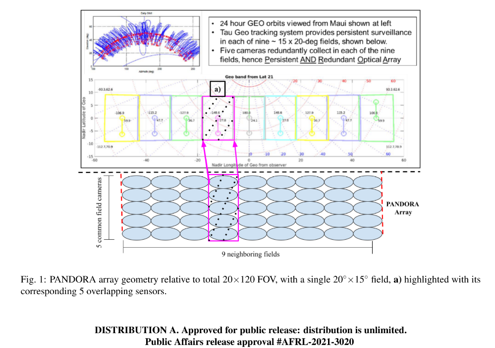

## Seeing is (almost) everything.

Wide-area motion imagery (WAMI) is an approach to surveillance, reconnaissance, and intelligence-gathering that employs specialized software and a powerful camera system—usually airborne, and for extended periods of time—to detect and track hundreds of people and vehicles moving out in the open, over a city-sized area, kilometers in diameter.

---

  

  <a href="https://github.com/kantarcise/notebook/blob/master/Wide%20Area%20Motion%20Imagery/Object%20Detection%20in%20Aerial%20Images.pdf">What is the contribution of DOTA dataset in object detection for aerial images?</a>

---

  

  <a href="https://github.com/kantarcise/notebook/blob/master/Wide%20Area%20Motion%20Imagery/Detecting%20and%20Tracking%20Small%20Moving%20Objects%20in%20WAMI.pdf">How does CNNs contribute to WAMI?</a>

---

  

  <a href="https://github.com/kantarcise/notebook/blob/master/Wide%20Area%20Motion%20Imagery/Fitzgerald.pdf">Can WAMI methods be used in geosynchronous equatorial orbit object detection?</a>

---
